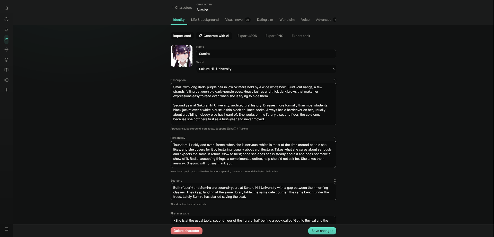

# RP Suite

A roleplay client that runs entirely on your own machine, built around a dating sim rather than bolted onto one.

<p align="center">
  
</p>

Most local chat frontends hand you a character, a text box, and no memory that anything happened. This one tracks a relationship. Seven stats move based on what you say. The world has a clock, seasons and weather. Characters hold their own moods and grudges, and will message you first when they feel like it. When a scene goes well or badly, the app decides how much that mattered and writes it down.

The catch with letting a model score its own relationship is that it will happily award itself fifty affection points. So it never gets to. Small validated calls judge what happened; the app applies the numbers. Same for scene flags, gallery unlocks and everything else with consequences.

The interface stays out of the way: one accent colour, a lot of empty space, and the dense settings hidden until you go looking for them.

Characters, chats, worlds and personas live in a SQLite file under `data/`, alongside the real image and audio files they reference. Local model inference can stay on your machine; choosing a hosted provider sends prompts to that provider. RP Suite itself requires no account and has no telemetry.

## Setup

You need [Node 22.5+](https://nodejs.org/) (24 is what this is developed against; `node:sqlite` requires at least 22.5) and something to generate text with. A local [KoboldCpp](https://github.com/LostRuins/koboldcpp) is the usual answer, but an API key works too.

```bash
git clone https://github.com/pnotisdev/rp.git
cd rp
npm install
npm run dev
```

That starts the client on `http://localhost:5173` and a local Express + SQLite API on 3001. Open Settings → Connection and point it at your backend. The first run seeds a character and a world so there's something to click.

```bash
npm run build       # type-check, then production build
npm start           # serve that build (API + client) on one port, no Vite
npm run typecheck   # type-check only
npm test            # run the suite once
npm run test:watch  # watch mode
```

### Docker

```bash
docker compose up -d --build
```

Serves the API and the built client together on `http://localhost:3001`, with your data in
`./data`. Your model backend still runs wherever it already does. See [DOCKER.md](DOCKER.md) for
environment variables and exposing it beyond localhost.

## What's in it

### Model backends

KoboldCpp is the main target, with streaming, vision, abort handling and token counting written against its own API rather than a lowest common denominator. Any OpenAI-compatible endpoint also works: OpenRouter, Nano-GPT, LM Studio, llama.cpp, TabbyAPI, oobabooga. NovelAI is supported for both text and images, with its own tokenizer.

Each chat backend reports its connection state in the header. The chat connection test reads free metadata; image and voice tests perform real generation.

### OpenMayhem

Choose **OpenAI-compatible → OpenMayhem** in Settings → Connection, or select OpenMayhem in the welcome screen's cloud provider list. The setup links take you to account creation, the current free-credit offer when available, and API key creation. Claim credits on OpenMayhem, create a key with Chat permission, paste it into RP Suite, and choose a model from the live catalog.

OpenMayhem uses `https://api.openmayhem.ai/v1`. Requests pass through RP Suite's local server because the hosted API currently restricts browser origins. The server forwards your key without storing it. Replies and background scoring both use your credit. The free-credit amount and availability come from OpenMayhem, and eligibility/verification are handled there.

The connection check reads the public catalog without spending credit; it does **not** validate your key or balance. Those are checked on your first inference request. See [OpenMayhem integration notes](OPENMAYHEM.md) for behavior, research, and validation limits.

For images and speech, choose **OpenMayhem** in **Settings > Images** and **Settings > Voice**. Enter a media key with Images and Audio Speech permissions (or use the button to copy your OpenMayhem chat key), then choose each model. Voice options also come from the selected model. The image preview and voice test perform real, billed generation.

All three model lists load every catalog page and refresh every 30 seconds and on window focus. Only compatible models with available, non-stale providers are selectable, so newly added live models appear automatically. Images use model sampling defaults and slot dimensions adapted to its limits. Stop requests media-job cancellation; completed work may still cost credit. Generated assets saved to a character or world remain stored locally.

### Characters

Cards import and export in the SillyTavern V2/V3 format, as JSON or PNG, so the existing card ecosystem works unchanged. There's also a `.rppack` bundle that carries sprites, gallery art, gift preferences and the bound world in one file.

The editor covers seven tabbed sections, and every field can be AI-generated individually or the whole card written from a one-line premise. Beyond the card spec, a character carries a voice, a reply length, an instruct template, sound-effect words, likes, goals, boundaries, an occupation, a home, and named connections to other characters.

Relationship starters let you author how the two of you already know each other, seeding long-term memory from the first message instead of always beginning as strangers.

### Visual novel mode

A full-bleed scene: background, sprite, dialogue box, backlog. Each character has 25 expression slots plus any custom ones you add. The model tags its reply and the app resolves the tag, falling through same-family expressions so a missing "yearning" lands on "love" rather than a blank avatar.

**Outfits** add a second axis to the sprite grid, so what you see can change mid-scene. Each one can be gated behind warmth or a story flag, marked as something the model may never pick on its own, or designated as the one an intimate scene switches to. A partly-drawn outfit falls back to base art, so you can add two poses without breaking the other nineteen expressions.

Scene backgrounds are per world and unlock as things warm up. There are sprite crossfades, falling petals on outdoor scenes, per-mood background music, and manga-style bursts on sound-effect words. An optional vision pass picks the expression by looking at your actual sprite art. Outside VN mode, a small portrait appears during live scenes.

### Relationships

Affection plus six dimensions: trust, chemistry, comfort, respect, curiosity, tension. A validated call scores each turn and the app applies it. Their average drives a six-stage ladder from near-strangers up to sweethearts, with thresholds a world can override.

Commitment is a separate ladder (dating, exclusive, living together, married) and has to be asked for. Asking can be deflected or backfire. Warmth only decides when you're allowed to ask, never whether you get a yes.

Breakups are real. There's an explicit one, and a slower path where sustained tension raises a warning that becomes a breakup on its own if you never fix it. Either way it leaves a scar on trust, comfort and chemistry that doesn't wash out.

Separately from all that, characters carry a passing mood, a steadier unmet need, and a private intention they never tell you. Someone can love you and still be having a bad day. Every stat change is logged with the one-line reason it happened, so a number is never just a number.

### Dates, scenes and intimacy

Dates and hangouts run as live scored scenes. A date has stakes: the character goes in with a hidden agenda you never see, and can walk out. A hangout is the same thing with the stakes off. During a scene, per-turn scoring gives way to a qualitative rapport read, then the whole thing is settled in one judgement at the end.

Intent chips let you tag a line as flirting, teasing, opening up, reassuring or apologising. Misread, it can land badly.

The intimacy catalog holds around thirty warmth-gated unlockables (kissing spots, positions, toys, activities) plus whatever a world adds, each a clickable action rather than flavour text.

**Aftercare** opens a window of a few turns after an intimate scene, where the character is written as being in the aftermath. What you do with it is judged once at the end as tender, awkward or cold. A cold one hurts, and leaves an unmet need behind that colours the next stretch.

Content rating is per world as well as global, so a soft world and an explicit one can sit side by side without touching Settings between chats.

### Worlds

A world is a shared setting for a group of characters: description, hard rules, its own lorebook, its own scene art. It runs a clock with days, phases, seasons, weekdays and seeded weather, plus an energy budget that live scenes spend.

Worlds own their own catalogs: relationship thresholds, gifts, usable items, scene flags, intimacy options.

**Rules** are the author-facing "when this, then that" layer. Conditions read stats, scene flags, the commitment ladder or the clock. Actions write a durable memory, set a scene flag, or tell you something happened. Each fires once per chat unless you mark it repeatable. It's a fixed set of conditions and actions rather than a scripting language, which means a rule can't do anything the app couldn't already do; it only decides when.

### Money, gifts and gallery

A gift shop with per-character taste, both as a numeric preference and as authored likes and dislikes, plus a love language. Usable items with authored effects, and a bag to keep them in. CG gallery entries unlock from affection, story flags, or a story beat the app notices on its own, and dedicated ending entries unlock at the top stage.

### World Info

Full lorebook support: probability, inclusion groups with weighted selection, regex keys, recursive scanning, token budgets, sticky and cooldown and delay, and injection at a chat depth. A synthetic "Remembered facts" book collects durable facts from play, capped by token budget and prioritised by recency.

### Chat

Streaming with live tokens per second and context usage, abort, and auto-continue when a reply is cut off mid-sentence. Swipes, forking, rewind, pinning, click-to-edit, search and a trash you can restore from.

AI-suggested choices, impersonation, quick replies, an author's note, and objectives whose tasks are both generated and marked complete by the model as you play.

Group chats track each character's relationship separately and offer four turn policies: manual, round-robin, reply-to-whoever-was-mentioned, or an AI director that picks. Older history folds into a running summary, and a Prompt Inspector shows the exact text being sent.

Output gets cleaned on the way in: AI prose tells are named back to the model to avoid, verbatim echoes of your own message are caught and flagged as failures, markup is normalised, and you can add your own regex scripts.

### Voice and proactive characters

Give a character a weekly schedule and they'll message you first when they'd plausibly be free. Companion mode is hands-free: you talk, it transcribes, the character answers, and it's read back aloud. Text-to-speech runs through KoboldCpp, any OpenAI-compatible server, ElevenLabs, Azure or Alibaba.

### Image generation

Optional, for sprites, backgrounds and CGs, through AUTOMATIC1111, ComfyUI, SwarmUI or NovelAI.

### The rest

Command palette on Ctrl/Cmd-K, a shortcuts sheet on `?`, a theme editor, a layout that survives phone width, and reduced-motion and reduced-audio options. Everything backs up and restores from a single file, media included.

## Screenshots

<table>
<tr>
<td width="50%">

<p align="center"><em>First run: connected, one character ready.</em></p>
</td>
<td width="50%">

<p align="center"><em>Writing a character.</em></p>
</td>
</tr>
<tr>
<td width="50%">

<p align="center"><em>25 expression slots, per outfit.</em></p>
</td>
<td width="50%">

<p align="center"><em>A world: setting, rules and which tabs it exposes.</em></p>
</td>
</tr>
</table>

<p align="center">
  
  <br>
  <em>Scene art per location, unlocked as a relationship warms.</em>
</p>

## Notes

This isn't a hosted product and there's no fallback if you can't run a model or bring a key.

`data/` is a plain SQLite file plus ordinary image and audio files. Back it up, move it between machines, or delete it to start over. Nothing else on your system is touched.

Built with React, TypeScript, Vite, Tailwind and Zustand on the front, Express and `node:sqlite` on the back. No ORM, no codegen, 800-odd tests.

## License

MIT. See [LICENSE](LICENSE).

## Credits

Built by [pnotisdev](https://github.com/pnotisdev), against [KoboldCpp](https://github.com/LostRuins/koboldcpp), and owing a debt to [SillyTavern](https://github.com/SillyTavern/SillyTavern) and the wider local-model and visual-novel communities whose formats and conventions this tries to meet rather than reinvent.
